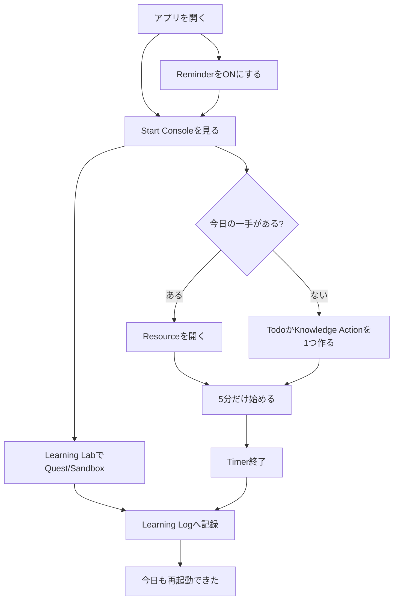

# Life Dashboard 説明書

Life Dashboardは、タスクを管理するためだけの画面ではありません。目的は、疲れている日でも3分で人生の軌道に戻るためのホーム画面を作ることです。

## 見やすいHTML版

ブラウザで図つきの説明を見る場合は、リポジトリのルートで以下を実行します。

```bash
npm run explain
```

その後、ブラウザで `http://127.0.0.1:4174/` を開きます。

ファイルを直接開く場合は `.explainApp/index.html` でも見られます。Mermaid図の描画にはCDNを使うため、ネットワークに接続している状態が推奨です。

## 目的

- 今日の一手を迷わず選ぶ
- Resourceを探す時間を減らす
- 5分だけ始めて、実績を作る
- 学習、健康、お金、創作、休息の偏りに気づく
- 記録を責める材料ではなく、再起動の材料にする

## 対象ユーザー

- 好奇心と学習意欲が高い
- 全体像が見えると動きやすい
- 完璧な戦略を作ろうとして初動が遅れやすい
- 入力が多いアプリは続きにくい
- 小さな前進、可視化、ゲーム性があると伸びやすい

## 主要機能

| 機能 | 役割 | 毎日使う度 |
| --- | --- | --- |
| Start Console | 今日の一手、Timer、Resourceをまとめる | 高 |
| Reminder | 開いている間に今日の一手へ戻す | 高 |
| Categories | TodoとLogを領域別に要約する | 高 |
| Life Balance | 幸福、健康、成長、お金、創作、休息を見る | 中 |
| Quick Log | 最小入力で活動を残す | 高 |
| Day Planner | 月〜日ごとにTodoを置き、予定を差し引いて時間割を見る | 中 |
| Goals | 長期目標と今日の一手をつなぐ | 中 |
| Knowledge | 学びを実行候補へ変える | 中 |
| Logs | 実績、日次レビュー、英語日記を残す | 中 |
| Learning Lab | Cloud QuestとSandboxで疑似クラウドを実践する | 中 |
| Projects / Resources | 行動に必要な道具を整理する | 低 |
| Settings | Notion整合性、データ管理を行う | 低 |

## 3分再起動フロー



## 使い方の基本

1. Todayを開く。
2. Start Consoleの「今やること」を見る。
3. 「5分だけ始める」を押す。
4. 必要なら「開くもの」から教材、Notion、開発環境を開く。
5. 終わったら「記録する」を押す。
6. 脱線しやすい日はReminderをONにして、15分後または1時間後に戻る。
7. 予定がある日はDay Plannerで曜日を選び、仕事、遊び、移動などを入れてからTodoを割り当てる。
8. Cloud Questで疑似クラウド、CLI、Code Runnerを触り、完了したらLearning Logへ保存する。
9. 自由に試したい日はSandbox Modeで失敗も含めて実践ログに残す。
10. 週間/月間実績は、Quick Logや集中セッションを記録すると表示される。

## 設計原則

- 毎日全部を管理しない
- 今日の一手だけを強く出す
- 入力はあとから補完する
- 指標は評価ではなく、次の行動に変換する
- 落ちた日でも戻れる画面にする
