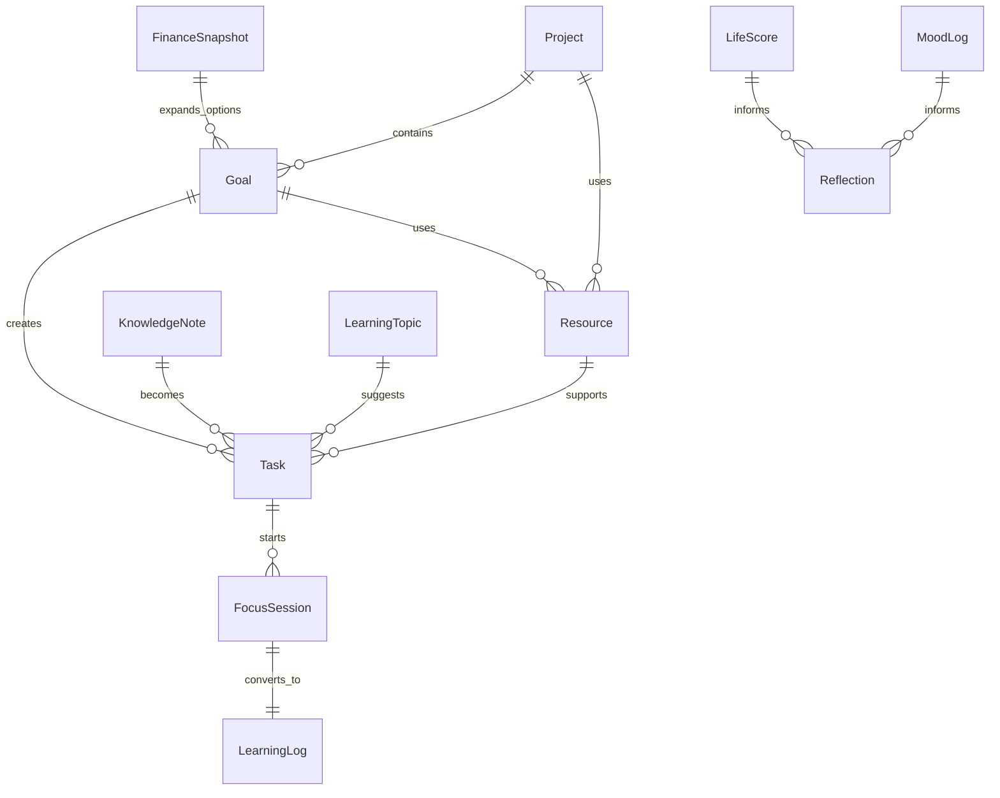
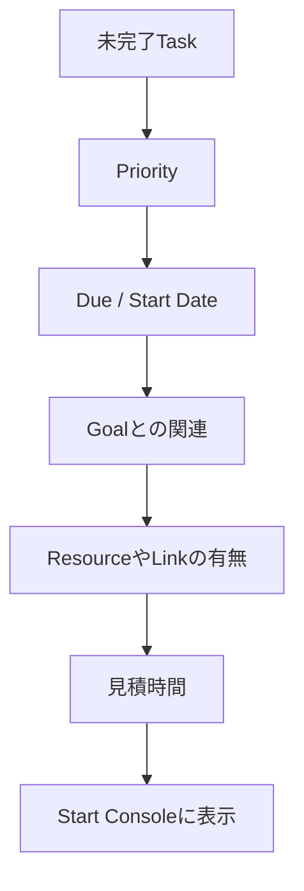

# データモデル

## 中心思想

中心はTaskではなく、今日の行動です。Goal、Knowledge、Resource、Finance、Moodはすべて「今日の一手」に戻るための文脈です。

## Entity一覧

### Task

今日動かす最小単位。

主なフィールド:
- `id`
- `title`
- `status`
- `priority`
- `area`
- `category`
- `genre`
- `estimatedMinutes`
- `due`
- `startDate`
- `link`
- `goalIds`
- `projectIds`
- `resourceIds`
- `completed`
- `completedAt`

### FocusSession

Timer中だけlocalStorageに保持する一時データ。

主なフィールド:
- `id`
- `taskId`
- `title`
- `startedAt`
- `accumulatedSeconds`
- `presetMinutes`
- `isRunning`
- `projectIds`
- `goalIds`
- `resourceIds`

### LearningLog

実績の記録。

主なフィールド:
- `id`
- `date`
- `minutes`
- `area`
- `category`
- `genre`
- `understanding`
- `energy`
- `memo`
- `relatedTaskId`
- `projectIds`
- `goalIds`
- `resourceIds`

### Goal

長期方向。

主なフィールド:
- `id`
- `title`
- `status`
- `area`
- `targetDate`
- `priority`
- `progress`
- `successCriteria`
- `memo`
- `projectIds`
- `resourceIds`

### Resource

行動開始に必要な教材、URL、ツール。

主なフィールド:
- `id`
- `title`
- `type`
- `url`
- `area`
- `category`
- `tags`
- `memo`
- `projectIds`
- `goalIds`

### KnowledgeNote

学びや調査のメモ。ActionableならTodo化できる。

主なフィールド:
- `id`
- `title`
- `area`
- `category`
- `genre`
- `sourceUrl`
- `summary`
- `body`
- `actionable`
- `actionText`
- `relatedTaskId`
- `relatedLogId`
- `projectIds`
- `goalIds`
- `resourceIds`

### LifeScore

人生の偏りを見る6軸スコア。

主なフィールド:
- `date`
- `happiness`
- `health`
- `growth`
- `money`
- `creation`
- `rest`
- `memo`

### MoodLog

その日の気分と身体感覚。

主なフィールド:
- `date`
- `mood`
- `energy`
- `stress`
- `sleepHours`
- `memo`

### FinanceSnapshot

家計簿ではなく、自由度を見る月次スナップショット。

主なフィールド:
- `month`
- `cash`
- `investment`
- `debt`
- `savingRate`
- `freeMonths`
- `memo`

### LearningTopic

学習ロードマップの現在地。

主なフィールド:
- `title`
- `area`
- `level`
- `roadmapStage`
- `nextOutput`
- `resourceIds`
- `goalIds`
- `status`

## 次の一手の判定

優先されるもの:
- 期限が近い
- 今日開始できる
- Goalにつながっている
- Resourceがあり、すぐ始められる
- 5分から30分程度で着手しやすい
