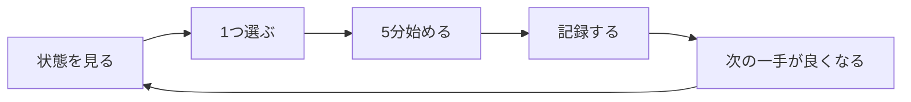
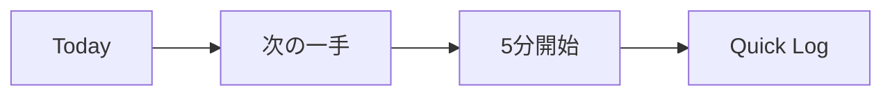

# 迷った時のスタートガイド

## このアプリで達成したいこと

Life Dashboardの目的は、人生の情報を全部入力することではありません。

目的は次の4つです。

1. 今の状態を短時間で確認する
2. 次にやる小さな行動を1つ選ぶ
3. 必要なResourceへすぐ移動して始める
4. 実績を残し、次の行動を少し良くする



スコアやログは評価表ではありません。次の行動を決めやすくするための材料です。

## 今すぐ使う手順

### 1. Todayを開く

最初に見る場所は常にTodayです。

見るもの:
- 「次の一手」
- 5分/15分Timer
- 関連Resource

最初は見なくてよいもの:
- 全Goal
- 全Knowledge
- 詳細なLife Score
- Notion整合性

### 2. 次の一手を1つ選ぶ

次の一手が表示されている場合は、そのまま使います。

表示されていない場合は、次のようなTodoを1つだけ追加します。

```text
応用情報を5問解く
READMEを1節直す
散歩を20分する
家計を10分だけ確認する
```

「勉強する」「開発する」のような大きな表現ではなく、5〜30分で始められる行動にします。

### 3. 5分だけ始める

迷っている時は5分を選びます。

15分を選ぶのは、既に作業内容が分かっている時だけで構いません。

### 4. Resourceを開く

Resourceは行動開始に必要な入口です。

例:
- 教材URL
- AP Practice
- Learning Lab
- Notionページ
- GitHub Issue
- ローカル開発環境

Resourceを登録する目的は、探す時間を減らすことです。

### 5. 一言だけ記録する

最低限、次の3つがあれば十分です。

```text
時間: 15分
領域: 応用情報
メモ: ネットワークを5問。サブネットを復習する。
```

タグ、理解度、関連Goalなどを毎回埋める必要はありません。

## 最初の設定

最初の10分では、次の5つだけ設定します。

- Goalを1つ
- Todoを1つ
- Resourceを1つ
- 5分Timerを1回
- Quick Logを1件

それ以外は、必要になった時に追加します。

## 状況別の入口

| 状況 | 開く画面 | 最初の操作 |
| --- | --- | --- |
| 何をすればよいか分からない | Today | 次の一手を見る |
| Todoがない | Today | 5〜30分のTodoを1つ作る |
| 応用情報を勉強したい | AP Practice | 最新年度を1問解く |
| CLIやクラウドを練習したい | Learning Lab | 好きなQuestを選ぶ |
| 調べた内容を残したい | Knowledge | 要点とActionableを決める |
| 一週間を整理したい | Goals / Day Planner | 来週のTodoと予定を置く |
| 同期できない | Settings | Notion整合性チェック |
| 気力がない | Today | 5分または休息Todoを選ぶ |

## 毎日・週次・月次

### 毎日



毎日はTodayだけで完結して構いません。

### 週1回

確認するもの:
- どのGoalが進んだか
- 来週のTodoは何か
- KnowledgeからTodoにするものはあるか
- 仕事、遊び、移動を含めて時間が取れるか

週次レビューの終了条件は、次の週に始めるTodoが1つ決まることです。

### 月1回

確認するもの:
- 幸福、健康、成長、お金、創作、休息の偏り
- 現金、投資、負債、貯蓄率、自由月数
- 来月減らすものと増やすもの

数値を良くすることより、生活の選択肢が増えているかを見ます。

## やらなくてよいこと

- 毎日すべての画面を開く
- 過去の行動を全部入力し直す
- 全Goalを完璧に分解する
- 24時間をすべて時間割にする
- Life Scoreを毎日高く保つ
- 記録できなかった日を埋め直す

空白の日があっても問題ありません。次に開いた日に5分で戻れることを優先します。

## 最後に

迷った時の合言葉はこれだけです。

```text
Todayへ戻る
次の一手を1つ選ぶ
5分だけ始める
```
