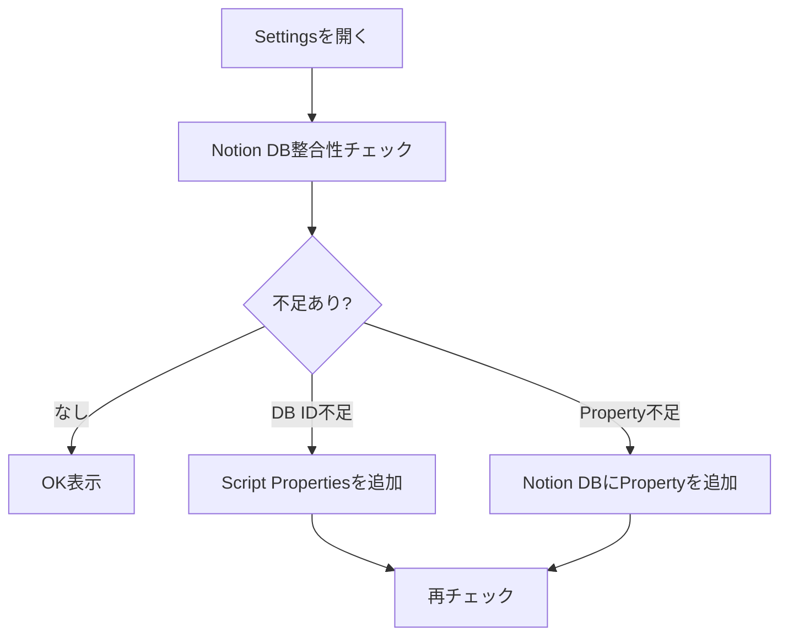
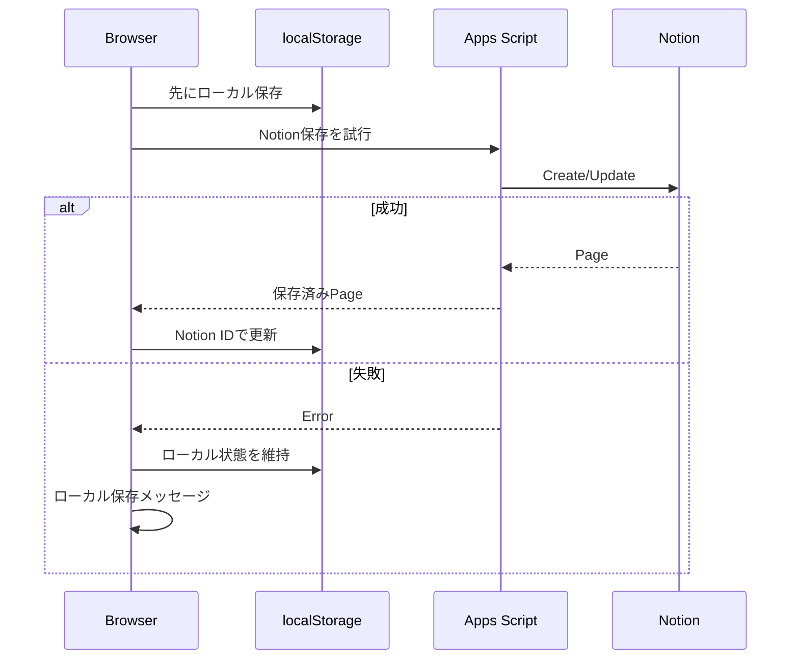

# 運用ガイド

## Notion整合性チェック

Settingsの「Notion DB整合性チェック」は、アプリが期待するDB IDとプロパティがNotion側にあるかを確認します。



## 不足DB IDの直し方

1. Apps ScriptのScript Propertiesを開く。
2. 表示された `*_DATABASE_ID` を追加する。
3. 値にはNotion DBのIDを入れる。
4. Settingsで再チェックする。

例:

```text
LIFE_SCORES_DATABASE_ID
MOOD_LOGS_DATABASE_ID
FINANCE_SNAPSHOTS_DATABASE_ID
LEARNING_TOPICS_DATABASE_ID
```

## 不足プロパティの直し方

1. Settingsの不足一覧をコピーする。
2. Notion DBを開く。
3. 表示されたProperty名を追加する。
4. 型はNotionの既存DB設計に合わせる。
5. 再チェックする。

## ローカル保存

以下はlocalStorageに保存されます。

- activeSession
- dayPlan
- AP Practiceの回答、復習キュー、ブックマーク、追加インポート問題
- LifeScore
- MoodLog
- FinanceSnapshot
- LearningTopic
- Notion保存失敗時の一時データ

注意:
- ブラウザのキャッシュ削除で消える可能性があります。
- 感情ログや資産情報を入れる場合、共有PCでは使わないでください。

## AP Practice問題データ追加

- 公式IPAの過去問題を確認し、JSON/CSV化したものをAP Practiceから追加します。
- 過去問道場からの直接取得、スクレイピング、問題データ複製は行いません。
- 年度一覧に「データ未追加」と出る年度は、問題データを追加すると演習可能になります。
- 図表が必要な問題は `imageRefs` にローカル画像パスを入れます。

## 同期失敗時



## 日次運用

- 朝: TodayでStart Consoleを見る
- 日中: 5分/15分Timerで着手する
- 終了時: Learning Logに変換する
- 夜: Logsで日次レビューを書く

## 週次運用

- Goalsで進んだ目標を確認する
- KnowledgeのActionableをTodo化する
- Resourceが足りないTaskにリンクを追加する
- 来週のStart Consoleに出したいTaskを作る

## 月次運用

- FinanceSnapshotを更新する
- LifeScoreのお金軸を見る
- 自由月数が増えたか確認する
- 節約ではなく、選択肢が増えた感覚を確認する
