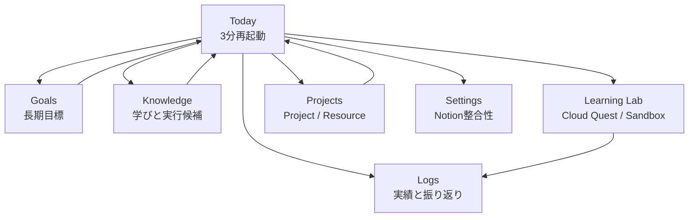
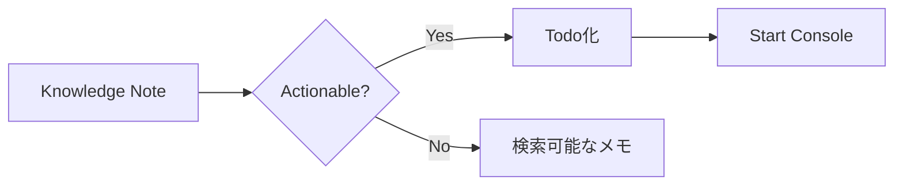

# 画面構成

## 全体の画面遷移



## Today

役割:
- 今日の一手を決める
- 5分/15分で始める
- Resourceを開く
- Reminderで脱線前に戻る
- カテゴリ別に今日の偏りを見る
- 仕事、遊び、移動、家事などの予定を入れて可動時間を見る
- 月〜日ごとにTodoを割り当てる
- Quick Logや集中セッションから週間/月間の実績を見る
- 今日の状態と活動量を見る
- 必要最小限のログを残す

PC:

```text
[Start Console: 今日の一手 + Timer + Resources + Reminder] [Progress]
[Life Balance] [Categories] [Quick Log]
[Day Planner: 月火水木金土日 + Todo時間割 + 実績チャート] [Todo一覧] [Shortcuts]
```

タブレット:

```text
[Start Console]
[Progress] [Life Balance]
[Categories] [Quick Log]
[Day Planner]
[Todo一覧] [Shortcuts]
```

スマホ:

```text
[今日の一手]
[5分開始 / 15分集中]
[開くもの]
[今日の活動]
[Life Balance]
[カテゴリ別の今日]
[Quick Log]
[時間配分 / 週月チャート]
[Todo一覧]
```

## Goals

役割:
- 長期目標を分解する
- GoalからTask/Habit/Resourceを作る
- 今日の一手へ戻す

使い方:
- 週1回だけ開く
- Goalを1つ選び、次に作るTaskを決める
- 毎日はTodayで動く

## Knowledge

役割:
- 学び、読書メモ、調査結果を残す
- 実行候補をTodo化する



## Logs

役割:
- Learning Log
- Daily Review
- 英語日記
- 日記カレンダー

設計:
- 詳細ログはLogsタブに置く
- TodayにはQuick Logだけを置く
- 英語日記は学習機能として残すが、毎日の主導線にはしない

## Projects

役割:
- Project、Goal、Resourceをまとめる作戦部屋
- 毎日ではなく、週次や設計時に使う

## Learning Lab

役割:
- Cloud Questでネットワーク、セキュリティ、IAM、DB、障害対応を実践する
- Sandbox ModeでQuestに縛られずCLI、疑似クラウド、Code Runnerを触る
- Quest完了やSandbox実践をLearning Logへ保存する

PC:

```text
[Quest一覧 / Filter] [Terminal / Cloud Console / Code Runner] [Quest Brief / 保存]
```

スマホ:

```text
[Mode / Filter]
[Quest一覧]
[Terminal]
[Quest Brief / Sandbox Memo]
```

## Settings

役割:
- Notionから再読み込み
- Notion DB整合性チェック
- ローカル表示キャッシュ削除
- アーカイブ管理

注意:
- 日常利用の画面ではない
- 足りないDB IDやプロパティを確認する場所
