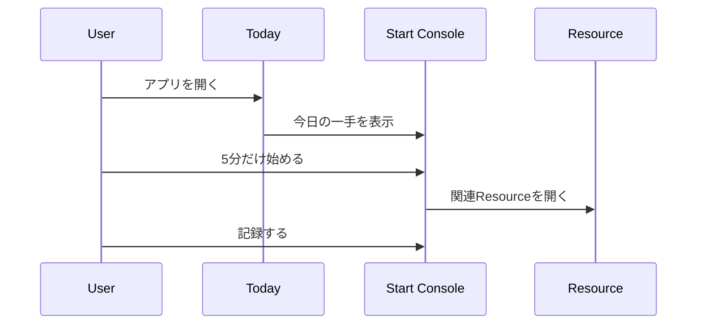
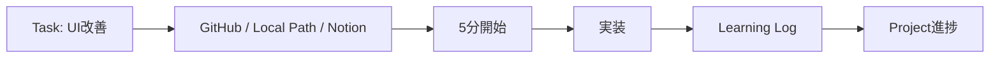
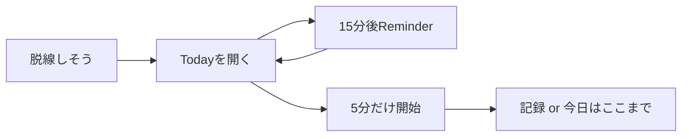
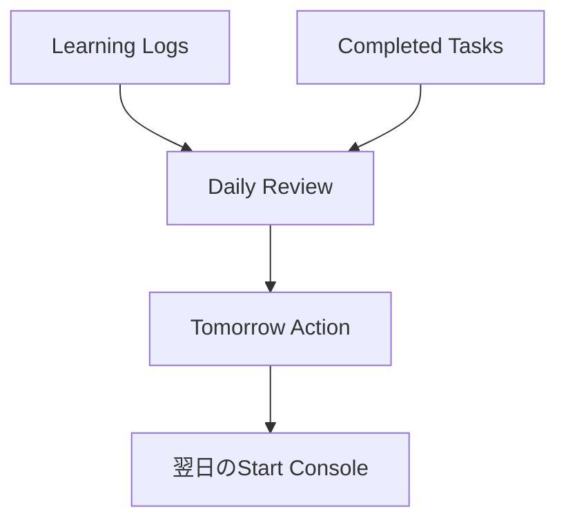
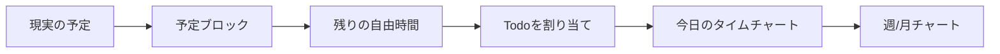
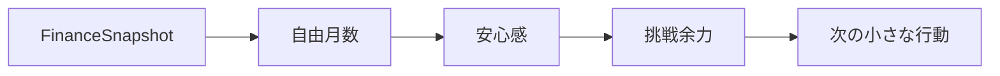

# ユースケース

このアプリは「何を記録するか」より先に、「どうやって動き始めるか」を助けます。

## 1. 朝の開始

成功状態:
- 最初に見るものが1つに絞られている
- 5分だけなら始められる
- 終了後にLearning Logが残る

## 2. 学習開始

例: 応用情報のネットワークを進めたい。

1. Todayを開く。
2. Start Consoleに「過去問道場 ネットワーク」が出る。
3. 「開くもの」から過去問道場を開く。
4. 15分集中する。
5. 終了後にログを保存する。

得られるもの:
- 学習時間
- 関連Goal
- 関連Resource
- 苦手ジャンルの履歴

## 3. 開発作業開始

例: Life DashboardのUIを直したい。

ポイント:
- 開発環境やIssueを探す時間を減らす
- TaskにResourceを紐づけるとStart Consoleに出る
- 完了できなくても「着手した」ことが実績になる

## 4. SNSやゲームに流れそうな時の復帰

1. Todayを開く。
2. Reminderで「15分後」を押す。
3. 「5分だけ始める」を押す。
4. Resourceを1つだけ開く。
5. 5分後に「今日はここまで」でもよい。
6. 15分後の通知で、必要ならもう一度Todayへ戻る。

狙い:
- 罪悪感ではなく、復帰の導線を作る
- 長時間の集中ではなく、最初の摩擦を下げる
- サイトを開いている間だけ、静かに戻るきっかけを作る

## 5. 夜の振り返り

1. Logsタブを開く。
2. 日次レビューに気分、エネルギー、よかったこと、明日の一手を入れる。
3. 今日のLearning LogとTodoが関連づく。

## 6. 予定が多い日の時間設計

1. TodayのDay Plannerを開く。
2. 固定勤務がない日は「固定勤務を使う」を外す。
3. 仕事、遊び、移動、家事、休息などの予定ブロックを追加する。
4. 残った自由時間にTodoを割り当てる。
5. 週間/月間チャートで、活動がどのくらい積み上がっているかを見る。

## 7. 週次レビュー

週次では、細かい入力を増やさず、以下だけ見る。

- どのGoalが進んだか
- どの領域が偏ったか
- 次の週に減らすもの
- 次の週に1つ増やすもの

## 8. 資産形成の月次確認

目的は家計簿ではなく、人生の選択肢が増えている感覚を得ること。

1. 月末にLife Balanceの「月次資産 / 学習テーマ」を開く。
2. 現金、投資、負債、貯蓄率、自由月数を入れる。
3. 来月の小さな改善を1つ決める。

