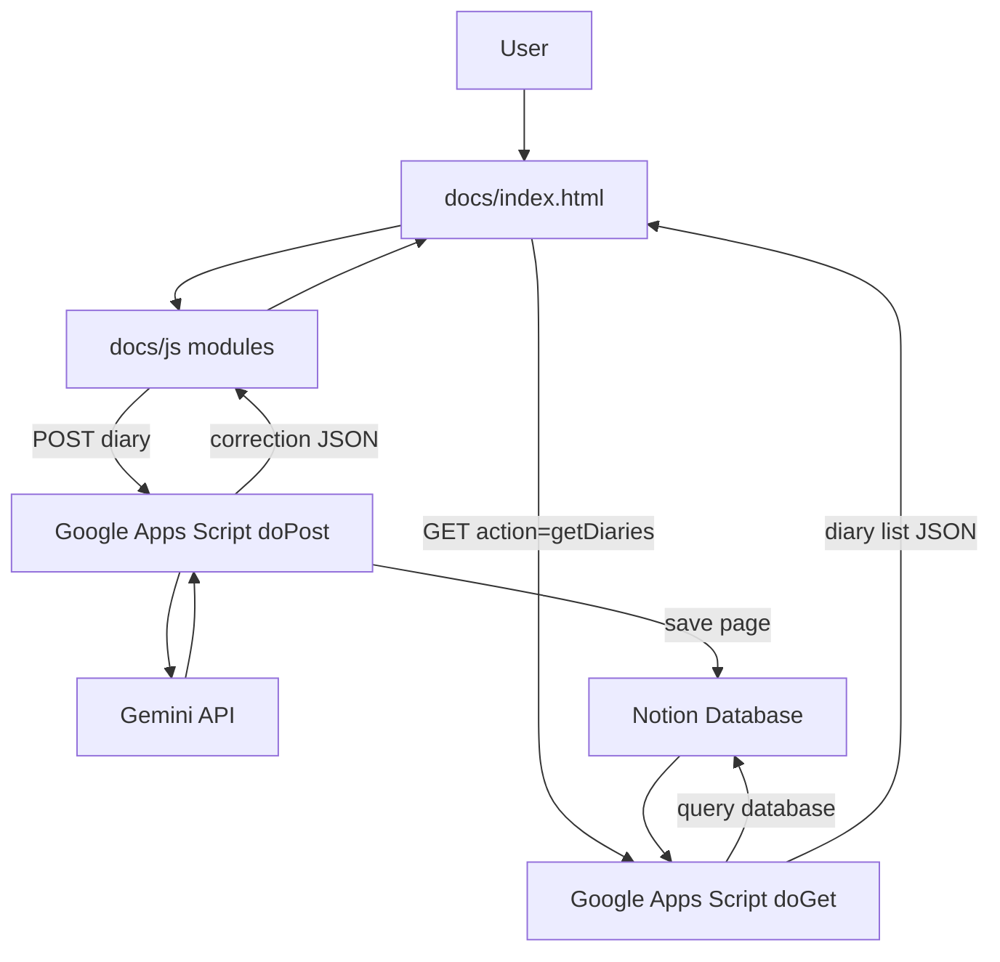

# Repository Overview

## 概要

このリポジトリは、静的フロントエンド、Google Apps Scriptバックエンド、Gemini API、Notion APIを組み合わせたAI日記アプリです。

## ディレクトリ

```text
.
├── docs/                  # GitHub Pagesで公開するフロントエンド
│   ├── index.html
│   ├── css/
│   └── js/
├── gas/                   # Google Apps Script
├── test/                  # Jest/Cypressテスト
├── common_understanding/  # 仕様・共通認識・ヒアリング結果
├── explain/               # 技術説明
├── package.json
├── jest.config.js
└── cypress.config.js
```

## 技術スタック

- Frontend: HTML, CSS, Vanilla JavaScript, ES Modules
- Calendar UI: flatpickr
- Backend: Google Apps Script
- AI: Gemini API
- Storage: Notion API
- Unit Test: Jest + jsdom
- E2E Test: Cypress
- Deploy frontend: GitHub Pages
- Deploy GAS: clasp

## 現在の処理フロー



## フロントエンド

- `docs/index.html` が画面本体
- `docs/js/main.js` が初期化処理
- `docs/js/app.js` が日記一覧取得、カレンダー、選択日表示を担当
- `docs/js/components/diaryForm.js` が日記送信と添削結果表示を担当
- `docs/js/components/darkModeToggle.js` がダークモード切り替えを担当
- `docs/js/config.js` がGAS Web App URLを保持

## バックエンド

- `gas/コード.js` の `doPost(e)` が日記投稿を受ける
- `gas/API.js` の `callGeminiAPI(text)` がGemini APIを呼ぶ
- `gas/prompt.js` が添削プロンプトを生成する
- `gas/gas_sample.js` の `doGet(e)` が日記一覧取得を処理する
- Notion APIキーやGemini APIキーはGAS Script Propertiesから読む

## 注意点

- フロントに置く値はブラウザから見える
- Gemini APIキーやNotion APIキーは絶対に `docs/` に置かない
- GAS Web App URLは公開情報に近いが、悪用対策はGAS側で考える必要がある
- 将来的に個人情報・感情・健康データを扱うなら、認証と保存方針の再設計が必要

